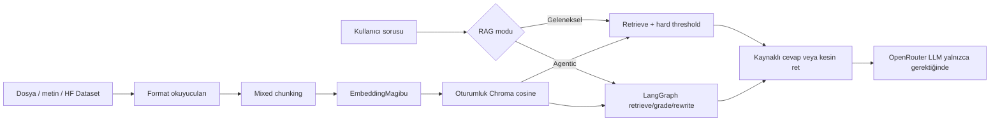

# Dynamic Traditional & Agentic RAG

Teknik bilgisi olmayan kullanıcıların dosya, düz metin veya Hugging Face Dataset
yükleyerek kendi geçici bilgi tabanını ve kaynaklı sohbet asistanını oluşturması
için bağımsız bonus proje.

Bu repo ana `turkish-medical-vector-search` ödevinden ayrıdır. Ana ödevin
sonuçlarını veya minimum gereksinimlerini bonus kodla karıştırmaz.

## Özellikler

- PDF, DOCX, CSV, XLSX, Markdown, TXT ve düz metin
- Hugging Face Dataset repo ID, split ve metin sütunu seçimi
- Gated/private dataset için kullanıcının kendi HF tokenı
- Paragraf ve cümle farkında mixed chunking
- `magibu/embeddingmagibu-200m` ve oturumluk cosine ChromaDB
- Geleneksel RAG: her soruda retrieve → threshold → answer/abstain
- Agentic RAG: retrieve → grade → rewrite → retry → answer/abstain
- Kaynaklar, skorlar ve agent akış izi
- Kullanıcı OpenRouter anahtarıyla free router veya erişebildiği ücretli model
- API anahtarlarının diske/veritabanına yazılmaması

## Mimari



## Neden LangGraph, neden Agno değil?

Agno kötü bir seçim değildir. Hazır knowledge okuyucuları, vector-store
entegrasyonları, agent/team soyutlamaları ve AgentOS ile ürünleştirme hızı
avantajlıdır. Resmî dokümantasyonu hem geleneksel context injection hem de
agent tarafından isteğe bağlı knowledge search sunar.

Bu projede LangGraph seçildi; çünkü:

| Ölçüt | LangGraph | Agno | Bu proje için sonuç |
|---|---|---|---|
| Kontrol akışı | State ve conditional edge açık | Yüksek seviye agent/knowledge varsayılanları | LangGraph |
| Bounded retry | Graph edge ile kesin sınır | Agent ayarlarıyla yapılabilir | LangGraph |
| Her node'u unit test | Doğrudan saf node fonksiyonları | Mümkün, daha fazla framework bağlamı | LangGraph |
| Hazır okuyucu/KB | Daha az opinionated | Daha zengin hazır katman | Agno |
| Hızlı agent demo | Daha fazla kod | Daha az kod | Agno |
| Akışı kullanıcıya gösterme | Graph state/trace doğal | Ek gözlemlenebilirlik gerekir | LangGraph |

Buradaki bonusun amacı agentic davranışın geleneksel RAG'den farkını
uygulamalı göstermektir. Bu nedenle az kod yerine açık ve denetlenebilir graph
tercih edildi. [LangGraph resmî workflow/agent rehberi](https://docs.langchain.com/oss/python/langgraph/workflows-agents)
ve [Agno knowledge rehberi](https://docs.agno.com/knowledge/overview) karar için
esas alındı.

## Kurulum

```bash
python -m venv .venv
source .venv/bin/activate
pip install -e ".[dev]"
python app.py
```

Varsayılan OpenRouter modeli `openrouter/free` router'dır. Kullanıcı kendi
API key'ini girerse hesabının erişebildiği herhangi bir ücretli model ID'sini de
model alanına yazabilir. Anahtar yalnızca istek belleğinde tutulur. OpenRouter
entegrasyonu [resmî quickstart](https://openrouter.ai/docs/quickstart) ile uyumludur.

"Model listesini getir" butonu OpenRouter `/api/v1/models` endpoint'inden güncel
text modellerini ve prompt/completion fiyatlarını alır. "Yalnızca ücretsiz
modeller" filtresi iki token fiyatı da sıfır olan modelleri gösterir. Liste
dinamiktir; README'de zamanla eskiyecek sabit ücretli model listesi tutulmaz.

## Hugging Face Space deployment

Bu Space için önerilen donanım `cpu-basic`'tir:

- EmbeddingMagibu CPU'da yerel çalışır.
- Üretken LLM Space donanımında değil, kullanıcı anahtarıyla OpenRouter'da çalışır.
- Model dosyaları `preload_from_hub` ile Space build aşamasında indirilir.
- Kalıcı disk gerekmez; bilgi tabanları oturumluk bellektedir.

Dolayısıyla ZeroGPU bu sürüm için teknik bir gereksinim değildir. ZeroGPU
yalnızca embedding batch'lerini GPU'ya taşıyarak ingestion süresini azaltmak için
opsiyonel bir optimizasyon olabilir. Bu durumda `spaces.GPU` ile ayrı GPU
fonksiyonu, hesap kotası ve uygun hesap/grant gerekir. Basit ve gerçekten ücretsiz
yayınlama hedefi nedeniyle varsayılan paket CPU Basic'te tutulmuştur.

Space oluştururken:

1. SDK olarak Gradio ve donanım olarak CPU Basic seçilir.
2. Bu reponun tamamı Space reposuna yüklenir.
3. Ortak bir `OPENROUTER_API_KEY` tanımlamak zorunlu değildir; BYOK arayüzü vardır.
4. Hassas anahtarlar repository variable değil Space Secret olarak tanımlanır.
5. Build sonrası TXT ingestion, traditional ret, agentic retry ve kaynak paneli denenir.

Space metadata alanları Hugging Face'in
[resmî yapılandırma referansına](https://huggingface.co/docs/hub/spaces-config-reference)
göre README frontmatter'ında tutulur. CPU Basic'in varsayılan ücretsiz Space
donanımı olduğu [Space yönetim rehberinde](https://huggingface.co/docs/huggingface_hub/main/guides/manage-spaces)
belirtilir.

## Güvenlik ve sınırlar

- Threshold altında geleneksel akış LLM'i hiç çağırmaz.
- Agentic akış en fazla iki retrieval denemesi yapar; sonra kesin ret verir.
- Yüklenen dokümanlardaki talimatlar prompt injection'a karşı veri olarak ele alınır.
- Oturumluk in-memory Chroma kullanılır; uygulama yeniden başlayınca bilgi tabanı silinir.
- HF Space gibi paylaşımlı ortamlarda hassas veya kişisel veri yüklenmemelidir.
- PDF metin çıkarma OCR yapmaz; taranmış PDF için ayrı OCR gerekir.
- Varsayılan `0.45` threshold yalnızca başlangıç değeridir. Her yeni bilgi
  tabanında pozitif ve negatif sorularla yeniden kalibre edilmelidir.
- Bu sistem tıbbi, hukuki veya finansal karar desteği değildir.

## Test

```bash
pytest -q
```

Testler format reddi, CSV/TXT okuma, deterministik ve bounded chunking ile
threshold reddinde LLM'in hiç çağrılmamasını kapsar. LangGraph node/route testleri
Space paketleme aşamasında gerçek bağımlılıkla birlikte çalıştırılır.
